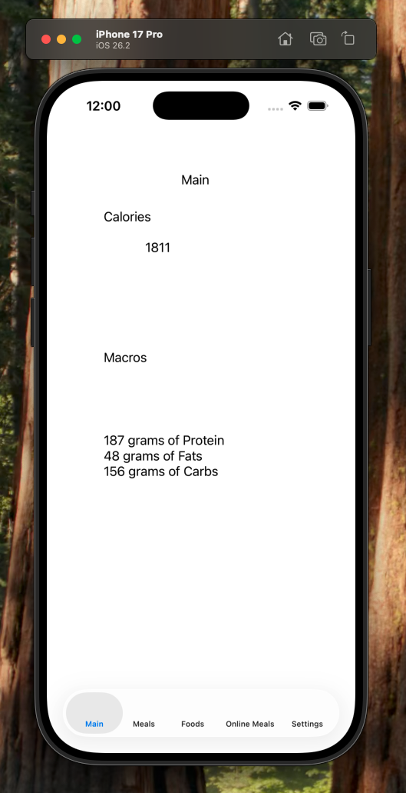
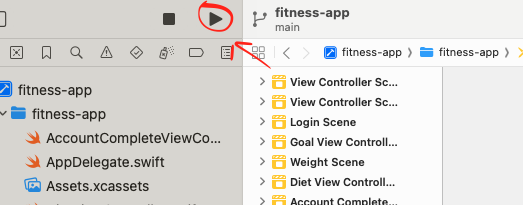
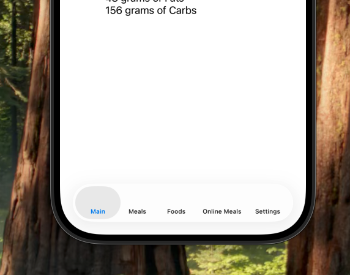

# Fitness App (Application Name: Baby Steps)

Fitness App demo to with to make any beginners fitness goals easy to accomplish.

## Tools

* Languages: iOS Storyboard, Swift

iOS Storyboard is an interactive user interface builder. Helps with visually seeing an app idea and connecting it simply with your expressive coding ideas.

## Example of Application Usage

Input your fitness goals and obtain the correct meals for losing weight, building muscle, or maintaining your physique. It's that simple!

  

## Instructions to Run Program

Git Clone the repository to your local computer and make sure to have xcode applicaiton already downloaded.
Open fitness-app in xcode.
You need to click run at the top of xcode and wait some time for the iphone simulator to run:

  

Once simulator is done running, you can either create your account in the fitness app or login to your exisiting account. Once your acccount is set up, you can view your calories and macros for the day along with other tabs that help you view your reccommended meals, online foods, online meals, and a settings tab for updating your user account. There is no database in the applicaiton, so your account information cannot be saved in the app or updated:

  

